# All Figures Review (single page)

Note: This page aggregates all figures so review can happen in one place.

## Strong scaling — Uniform (headline)
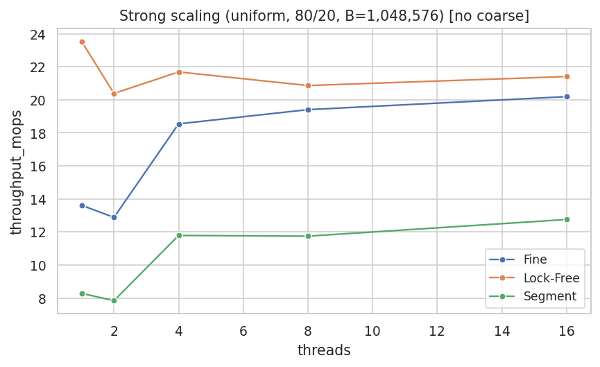

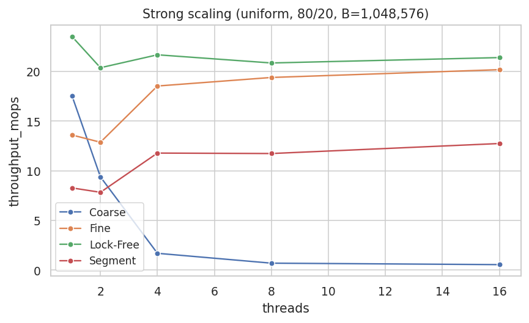

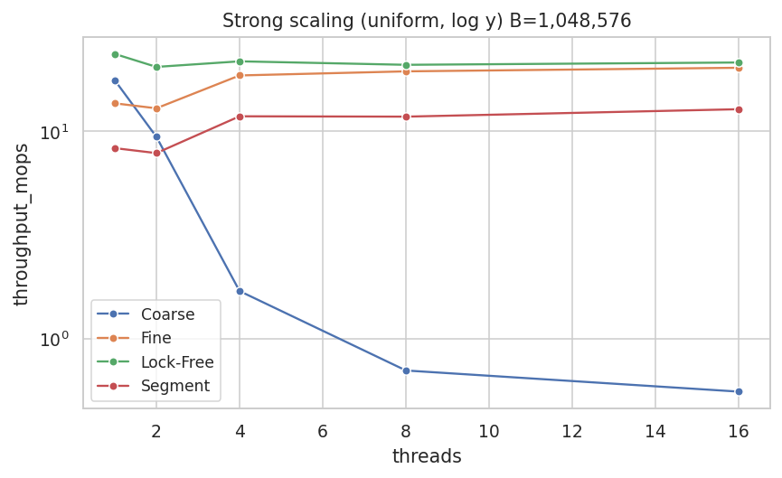

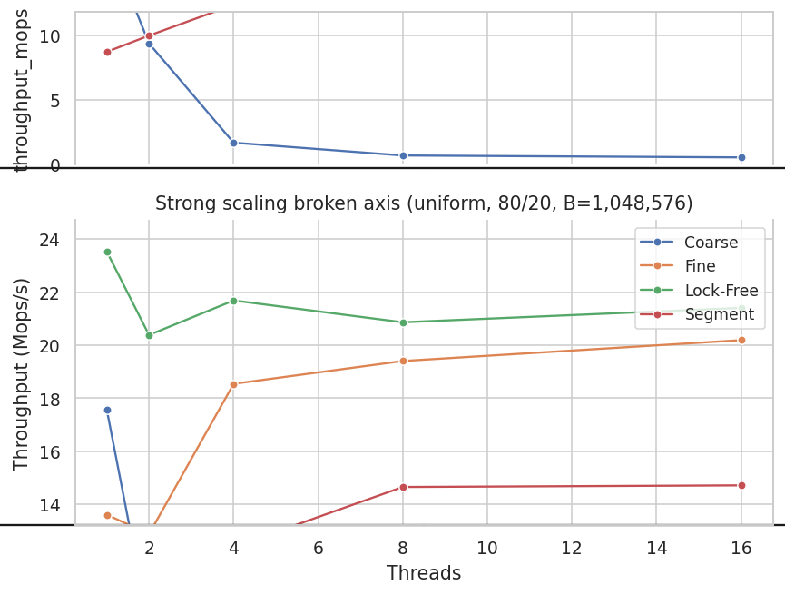

## Strong scaling — Skew p_hot=0.90 (headline)
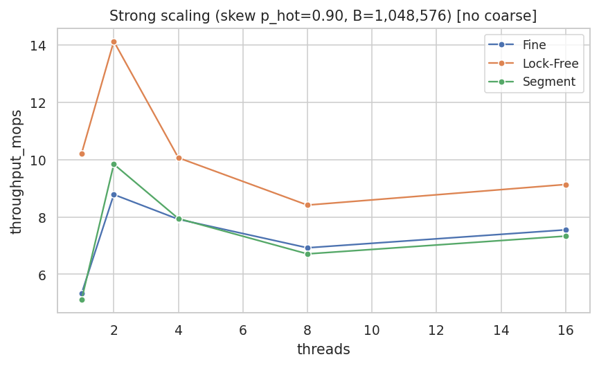

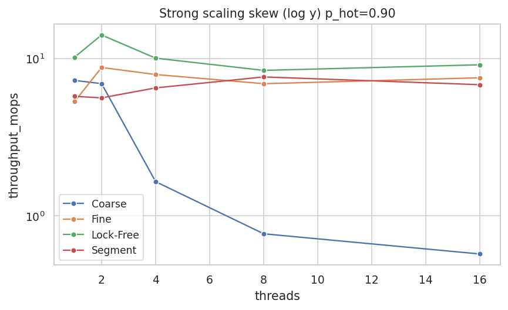

## Weak scaling — Uniform
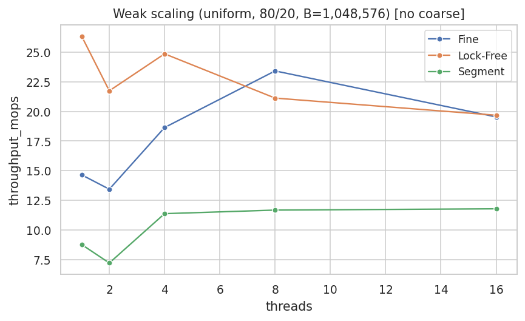

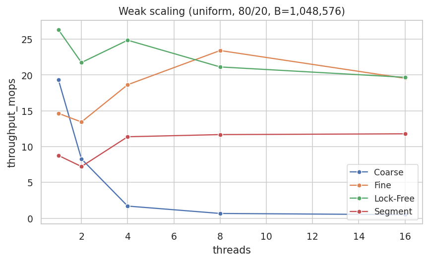

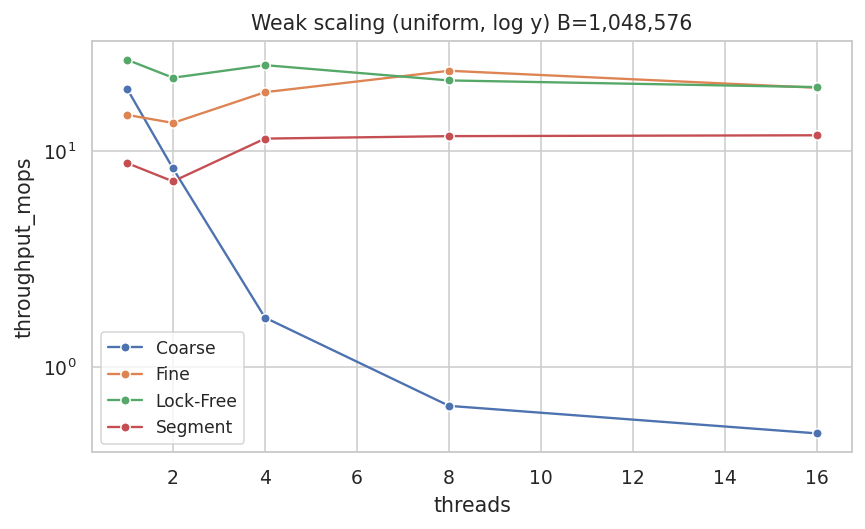

## Load-factor sensitivity (T=16)
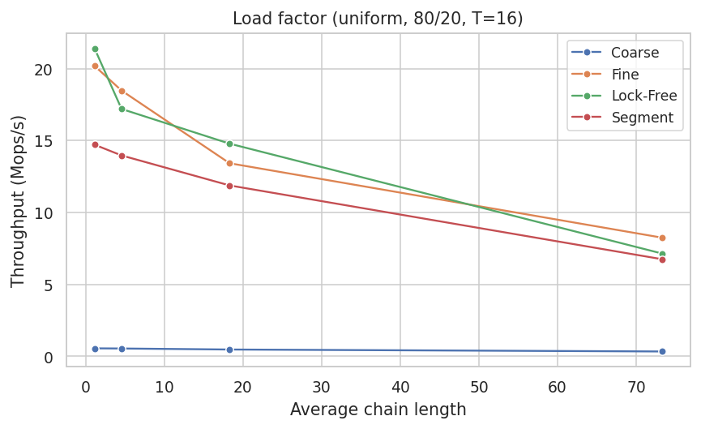

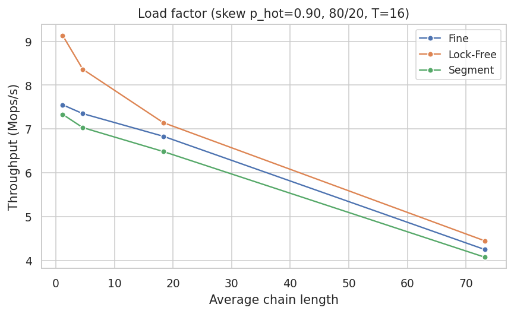

## Speedup and Efficiency
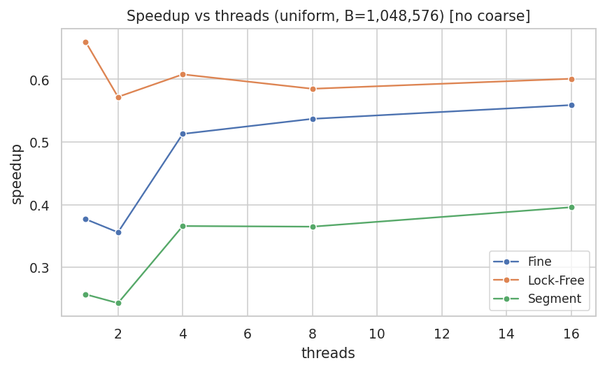

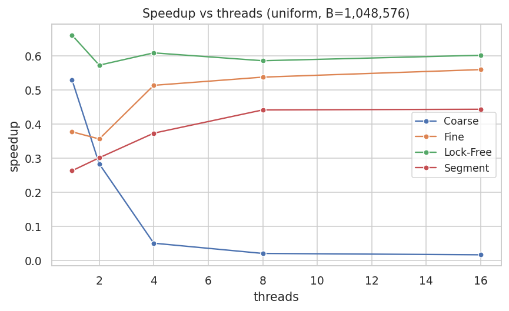

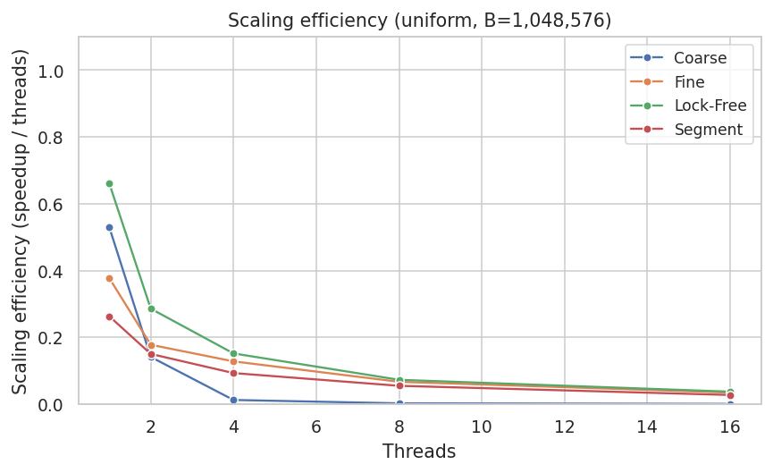

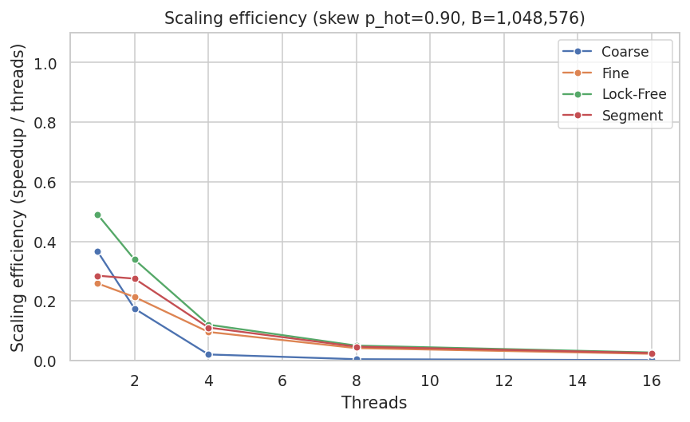

## Facets (optional)
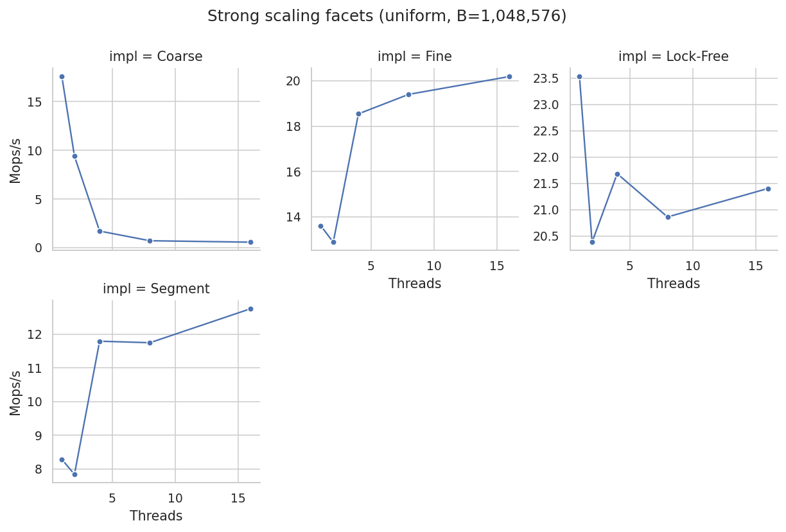

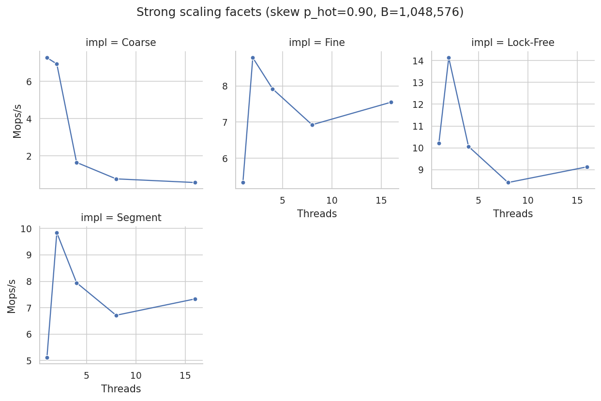

## Normalized (optional)
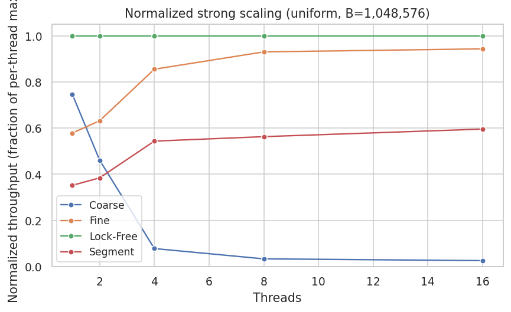

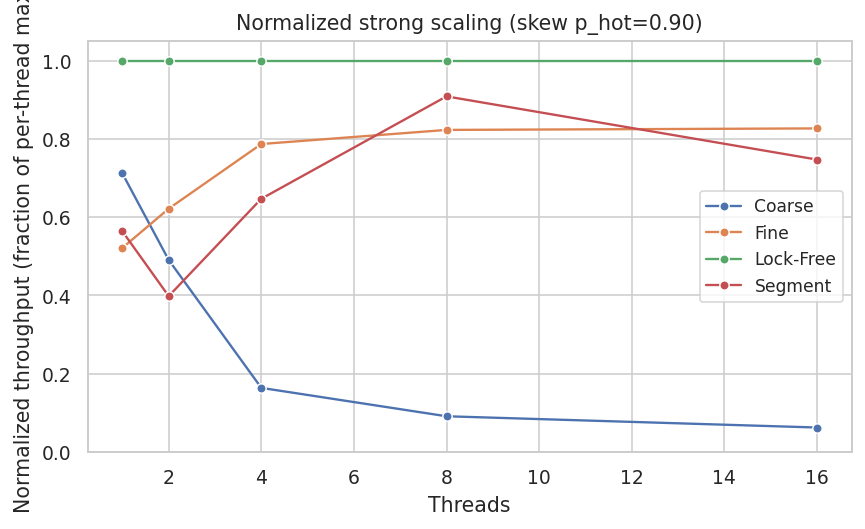

## AGH tuning (T ≤ 16)
If present:
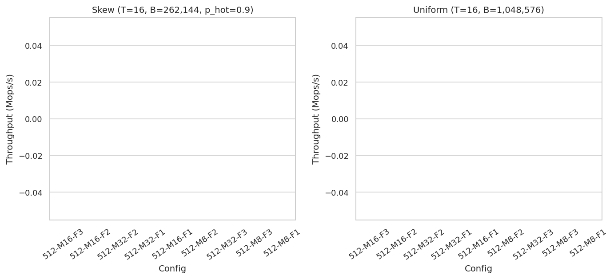

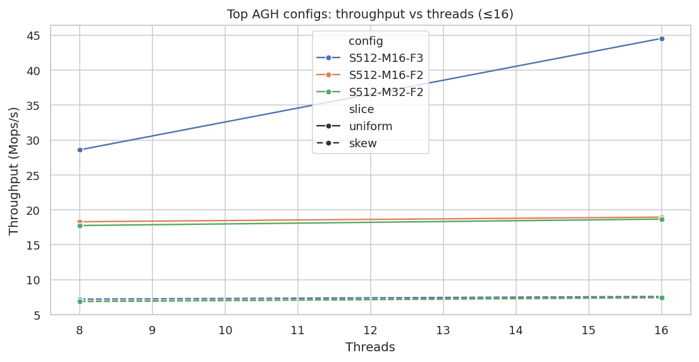
